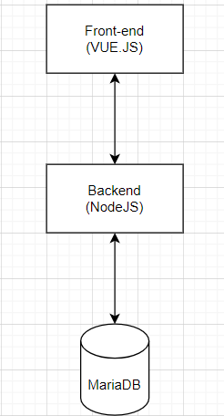
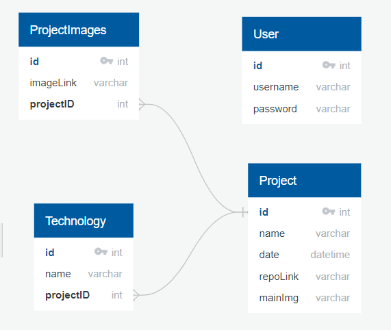

# Technical Design Document (FDD)

## Framework/Languages
For the frontend i plan on using HTML/CSS/JS with the VUEjs framework.
For the Backend i plan on using a webservice made with Nodejs in combination with the express package.
For data storage i will use a mariaDB Database.

## Architecture

## ERD diagram

## Deployment

### Database
I plan on using [Filess](https://filess.io/ "filess hosting") for the hosting of my database.

### Frontend + Backend
I plan on using Render to deploy both the frontend + backend it. This way when a update is pushed towards the production branch it will automatically update the site.

## Risks

### Time shortage
If for some reason i am behind on schedule i will cut back on features in order of importance laid out in the MoSCoW table

### Data Loss
To makes sure i avoid a major setback if i lose data because for example: equipment failure. i will make sure i push my progress to github very regularly.

## Security
Security plays a big role as i don't want unauthorized people accessing my portfolio and changing things about it.
To that end im encrypting my passwords before i save them in the DB. I also will implement a SSL certificate.

## Performance
Performance is a priority as the website needs to load within 2 seconds. i will use lighthouse to see what the bottlenecks are and fix those.